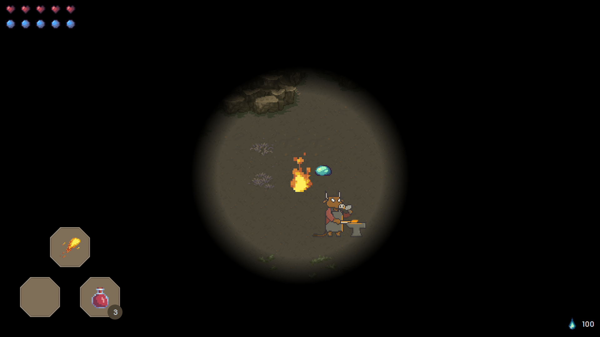
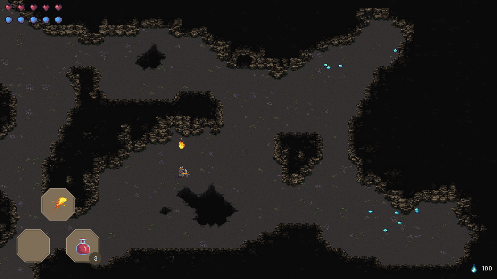
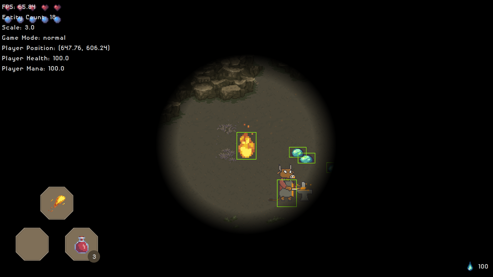
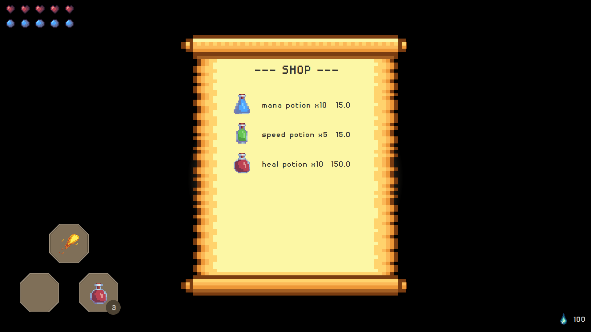

# 📜 Projet Level One - Moteur de jeu RPG 2D

## Introduction

Le projet Level One consiste à développer le premier niveau d'un jeu vidéo en 2D utilisant Java et JavaFX.L’objectif est de proposer une expérience interactive où le joueur incarne un personnage évoluant dans un environnement défini, affrontant des ennemis, interagissant avec des PNJ et manipulant divers objets.

Ce projet est construit avec une architecture ECS (Entity-Component-System), une approche modulaire qui sépare les entités (objets du jeu), les composants (leurs caractéristiques) et les systèmes (la logique du jeu). Cette structure permet une meilleure flexibilité, performance et extensibilité.

Les fonctionnalités de base sont implémentées :

- [X] Déplacement et collisions (uniquement avec la carte)

- [X] Interaction avec les PNJ et l'environnement

- [X] Gestion d'inventaire (consommables, artefacts, sorts)

- [X] Ennemis et combat

L'objectif principal était de rendre le jeu aussi générique que possible pour faciliter l'ajout de nouvelles fonctionnalités, tout en explorant des concepts avancés tels que les design patterns, les callbacks et la généricité.

## Aperçus

*Interface principale du jeu.*

*Carte complète*

*Vue en mode debug*

*Boutique*
---

## 🎮 Commandes

| Action | Touche |
|--------|--------|
| Déplacement | **Z Q S D** |
| Interagir avec un PNJ / Acheter un consommable | **A** (en cliquant sur l'objet) |
| Lancer un sort (si suffisamment de mana) | **E** (la direction du projectile suit celle du joueur) |
| Changer d'artefact | **&** |
| Changer de sort | **É** ou **T** |
| Changer de consommable | **"** |
| Consommer un objet | **B** |
| Activer/Désactiver le mode debug | **F3** |
| Afficher/Masquer les hitboxes | **F4** |
| Activer/Désactiver l’éclairage | **Espace** |

---

## Objectif

Le but du jeu est simple : **éliminer tous les ennemis**.  
Le joueur perd la partie s'il :
- Perd tous ses points de vie
- Tombe dans le vide (ex. : trous dans la carte)  